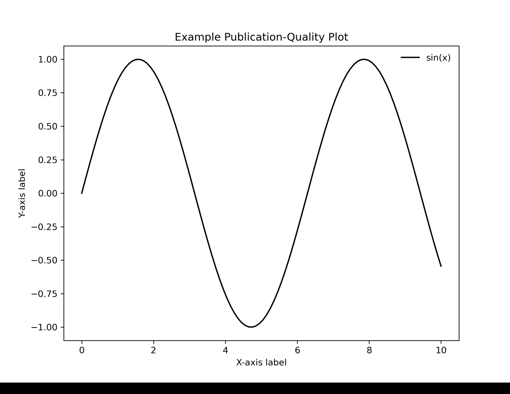

# Publication-Quality Plot Style for Python Matplotlib

This Python package provides a simple function to set up publication-quality plotting styles for scientific figures, compatible with journals like **Astronomy & Astrophysics (A&A)** and **The Astrophysical Journal (ApJ)**.

## 📚 Features

- LaTeX-rendered text for labels and titles
- Times New Roman serif font
- High-resolution figures (300 DPI)
- Clean appearance: inward ticks, minor ticks, customised grid and legend
- Saves figures as high-quality PDF files

## 🎞️ Example Comparison

Here is a comparison between a standard Matplotlib plot vs. a publication-quality styled plot:



## 🚀 Installation

Simply clone the repository:

```bash
git clone https://github.com/your-username/publication-plot-style.git
cd publication-plot-style
```
### Usage

```python
from plots_styl import set_pub_style #import the package
set_pub_style() # Apply publication style
